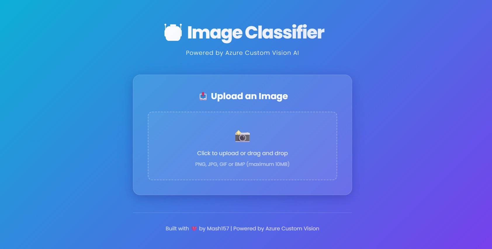
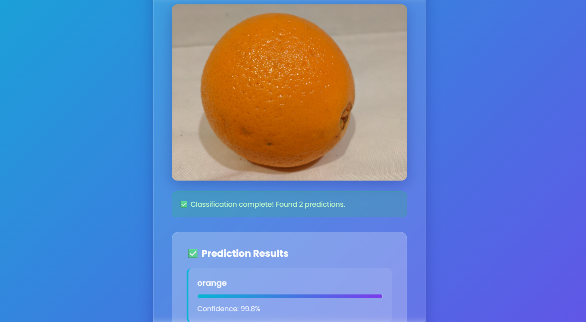
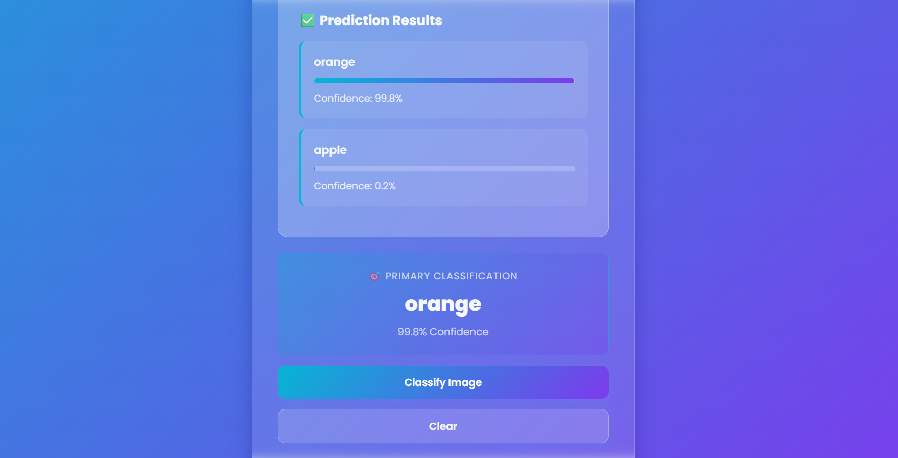

# 🤖 AI Image Classifier

🚀 **Live Demo:**  
👉 https://ai-image-classifier-dqn7.onrender.com/

A modern, production-ready AI-powered image classification web application built using **Flask**, **Azure Custom Vision**, and deployed on **Render**.

---

## 🌍 Live Application

This app allows users to:

- Upload an image
- Send it to Azure Custom Vision
- Receive classification results
- View confidence percentages with animated bars
- See the primary predicted class

Fully responsive. Cloud deployed. CI/CD enabled.

---

# 🖼️ Application Screenshots

## 🟣 1️⃣ Home Screen – Modern Glassmorphism UI



---

## 🟢 2️⃣ Image Upload & Classification in Action



---

## 🔵 3️⃣ Prediction Results with Confidence Bars



---

## 🏗️ Tech Stack

| Layer | Technology |
|--------|------------|
| Backend | Flask |
| Production Server | Gunicorn |
| AI Model | Azure Custom Vision |
| UI | Modern HTML + CSS (Glassmorphism + Gradient Design) |
| Hosting | Render |
| Version Control | Git + GitHub |

---

## ✨ Features

- 🎨 Modern glassmorphism UI
- 🌈 Animated gradient background
- 📱 Fully responsive layout
- 📊 Real-time confidence bars
- ☁️ Cloud-hosted AI model
- 🚀 Auto deployment from GitHub
- 🔐 Secure environment variables
- 💡 REST API integration

---

## 📂 Project Structure

```
python/
│
├── flask_app.py
├── app.py
├── index.html
├── templates/
├── requirements.txt
├── render.yaml
├── docs/
│   ├── home.png
│   ├── upload.png
│   └── results.png
└── README.md
```

---

## ⚙️ Local Installation

### 1️⃣ Clone Repository

```
git clone https://github.com/mash157/imageclassifier-azure.git
cd imageclassifier-azure/Labfiles/image-classification/python
```

---

### 2️⃣ Create Virtual Environment

```
python -m venv venv
venv\Scripts\activate   (Windows)
```

---

### 3️⃣ Install Dependencies

```
pip install -r requirements.txt
```

---

### 4️⃣ Configure Environment Variables

Create a `.env` file:

```
PredictionEndpoint=your_endpoint
PredictionKey=your_prediction_key
ProjectID=your_project_id
ModelName=your_model_name
```

---

### 5️⃣ Run Flask App

```
python flask_app.py
```

Runs on:
```
http://localhost:5000
```

---

## 🚀 Production Deployment (Render)

Environment:

- Runtime: Python
- Build Command:
```
pip install -r requirements.txt
```
- Start Command:
```
gunicorn flask_app:app
```
- Environment Variable:
```
PYTHON_VERSION = 3.10.13
```

---

## 🌐 API Endpoints

| Method | Endpoint | Description |
|--------|----------|-------------|
| GET | / | Load UI |
| POST | /api/predict | Classify image |
| GET | /api/health | Health check |

---

## 🧠 How It Works

1. User uploads image
2. Flask backend sends image to Azure Custom Vision
3. Azure returns top predictions
4. Backend processes response
5. UI displays ranked results with confidence bars

---

## 🔐 Security

- API keys stored in environment variables
- `.env` excluded via `.gitignore`
- No secrets committed to GitHub
- Production served via Gunicorn

---

## 🏆 Deployment Status

✅ Live in Production  
✅ Azure Model Connected  
✅ Flask Backend Running  
✅ Render Hosting Active  
✅ CI/CD Enabled  

---

## 👨‍💻 Author

Built with ❤️ by Mash157

---

## ⭐ Support

If you like this project, give it a ⭐ on GitHub!